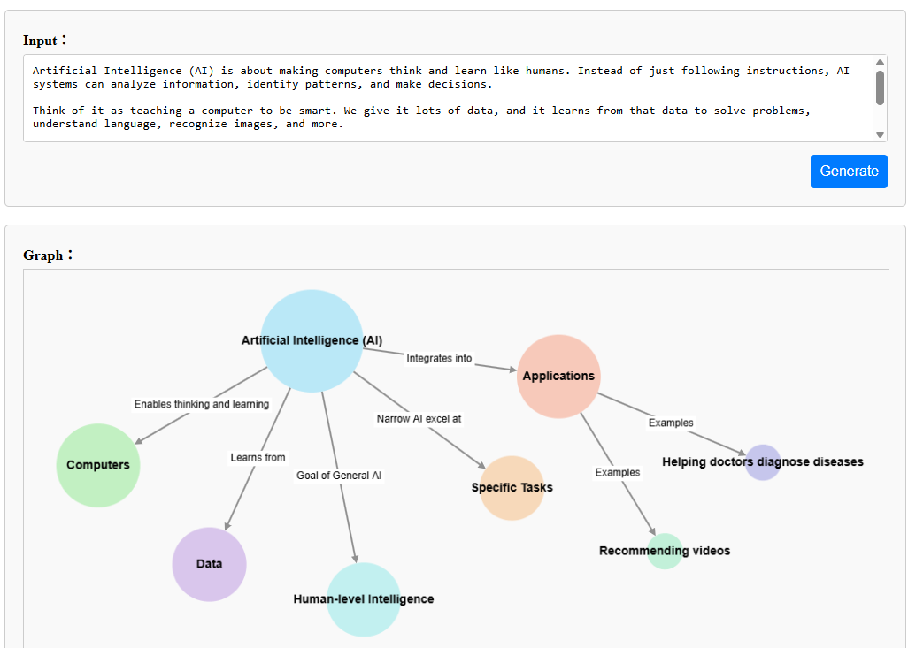
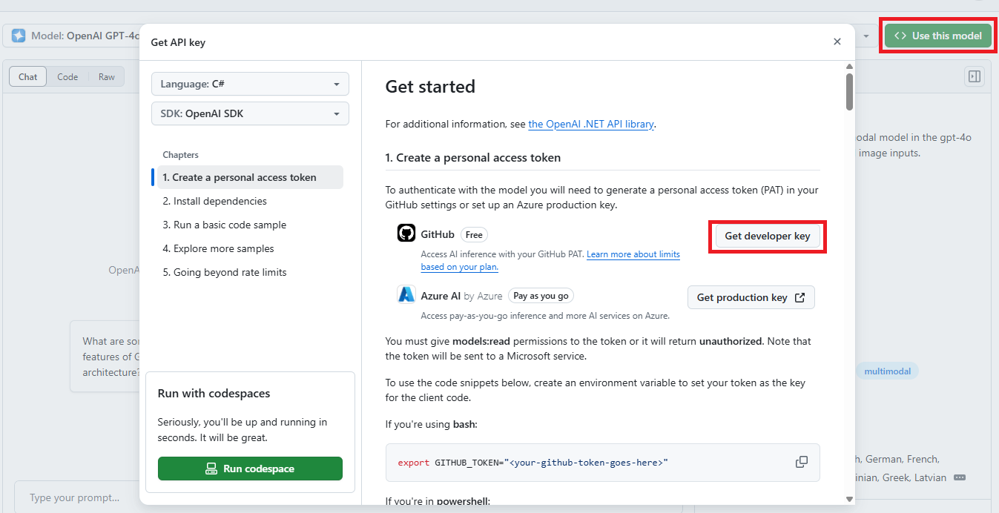

# Donet-AI-KGgen

- .NET 9 Microsoft.Extensions.AI exercise - generate knowledge graph

## Use GitHub Model (free)

- We can use GitHub personal access token for development. 
- Visit https://github.com/marketplace/models/azure-openai/gpt-4o/playground.
- Click `Use this model` > `Get developer key`, this will take us to the GitHub personal access tokens management page.
- Generate a new token and get a key similar to `ghp_...`. Copy this key and set it in `appsettings.Development.json`.

